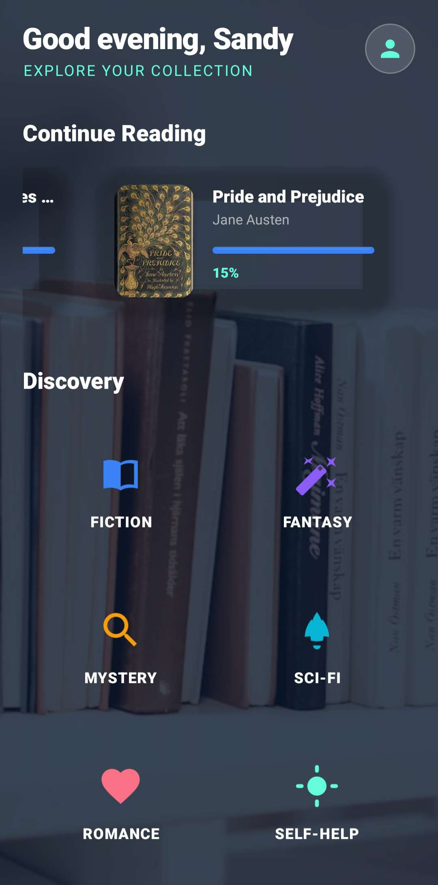

# Experiment 8 — Implement Menus and WebView

### BookNest — Android Book Discovery Application

This project is a continuation of the BookNest application, developed as part of the MCA Android Development laboratory. Building upon Experiment 5 (Android Notifications) and Experiment 6 (Basic Android Views), **Experiment 8** demonstrates the implementation of **Android Options Menus** for intuitive cross-screen navigation and **Android WebView** for dedicated in-app web browsing and book reading.

---

## 1. Experiment Details

*   **Experiment Number:** 8
*   **Experiment Name:** Implement Menus and WebView in an Android Application
*   **Application:** BookNest
*   **Language:** Kotlin
*   **Platform:** Android
*   **IDE:** Android Studio
*   **Developer:** Sandy
*   **USN:** 25MCAR0133
*   **Course:** MCA

---

## 2. Aim
To develop an Android application utilizing **Android Options Menus** for application navigation and **Android WebView** for displaying web content directly within the app, demonstrating their integration into an interactive BookNest book discovery application.

---

## 3. Objective
*   Implement a standard Android Options Menu (`res/menu/main_menu.xml`) providing quick navigation across core screens (Home, Browse Genres, Favorites, Settings).
*   Handle menu item selections (`onOptionsItemSelected`) cleanly across multiple Activities.
*   Implement a dedicated in-app reading screen using Android `WebView` (`WebViewActivity`).
*   Configure secure WebView settings (JavaScript enablement, zooming, caching).
*   Manage page loading states (`WebViewClient`, `WebChromeClient`, and `ProgressBar`).
*   Handle hardware and UI back-button navigation (`canGoBack()` history management).
*   Log Activity lifecycle callbacks (`Log.d`) for debugging and lab demonstration.

---

## 4. Scenario
BookNest is a digital sanctuary for book discovery and reading. In Experiment 8, navigation and reading capabilities are enhanced:
1.  **Options Menu Navigation**: Users can access the top-right options menu from any main activity (`MainActivity`, `BookDetailsActivity`, `GenreDetailsActivity`, `UserSettingsActivity`) to instantly jump to **Home**, view **Favorites**, browse **Genres**, or open **Settings**.
2.  **In-App Reading (WebView)**: When a user taps **"Read Online"** on any book details screen, instead of launching an external browser, the app opens a dedicated `WebViewActivity` that loads the legitimate public-domain reading resource (e.g., Project Gutenberg) directly inside the app with custom toolbar controls and loading progress.
3.  **Lifecycle Demonstration**: Navigating between screens and triggering lifecycle states automatically logs messages to Logcat (`onCreate`, `onStart`, `onResume`, `onPause`, `onStop`, `onDestroy`).

---

## 5. Core Concepts & Implementation

### A. Android Options Menu (`main_menu.xml`)
The options menu provides standardized access to key application features:
*   **Home (`action_home`)**: Returns to the main dashboard (`MainActivity`).
*   **Browse Genres (`action_browse`)**: Quick access to category exploration.
*   **Favorites (`action_favorites`)**: Displays a Toast summary of book titles marked as favorites.
*   **Settings (`action_settings`)**: Opens `UserSettingsActivity` for user preferences and profile details.

### B. Android WebView (`WebViewActivity.kt`)
Replaces external browser intents with a secure in-app browsing experience:
*   **`INTERNET` Permission**: Declared in `AndroidManifest.xml` to allow network requests.
*   **`WebViewClient`**: Ensures links and redirects load within the app's `WebView` rather than escaping to external browsers.
*   **`WebChromeClient`**: Tracks loading progress (`onProgressChanged`) to update the top `ProgressBar`.
*   **Back Navigation**: Uses `OnBackPressedDispatcher` to check `webView.canGoBack()` before finishing the activity.

### C. Activity Lifecycle Logging
Every core activity implements standard lifecycle logging using `Log.d` with unique component tags:
*   `MainActivity` (`TAG = "MainActivity"`)
*   `BookDetailsActivity` (`TAG = "BookDetailsActivity"`)
*   `WebViewActivity` (`TAG = "WebViewActivity"`)
*   `UserSettingsActivity` (`TAG = "UserSettingsActivity"`)
*   `GenreDetailsActivity` (`TAG = "GenreDetailsActivity"`)
*   `LoginActivity` (`TAG = "LoginActivity"`)

---

## 6. Technology & Event Handling

### Event Listeners Used:
*   **`onCreateOptionsMenu` / `onOptionsItemSelected`**: Handles standard menu inflation and action dispatching.
*   **`setOnClickListener`**: Controls toolbar back buttons, refresh buttons, and navigation.
*   **`OnBackPressedDispatcher`**: Intercepts back presses to navigate WebView history.
*   **`WebViewClient.onPageStarted` / `onPageFinished`**: Toggles loading indicators.

---

## 7. Project Structure
```text
BookNest/
├── app/
│   ├── src/
│   │   └── main/
│   │       ├── java/com/example/exp5notification/
│   │       │   ├── data/
│   │       │   │   ├── Book.kt (Parcelable Model)
│   │       │   │   └── BookRepository.kt (Dynamic Data)
│   │       │   ├── notifications/
│   │       │   │   └── NotificationHelper.kt (Exp 5 Notifications)
│   │       │   └── ui/
│   │       │       ├── LoginActivity.kt
│   │       │       ├── MainActivity.kt
│   │       │       ├── HomeFragment.kt
│   │       │       ├── BookDetailsActivity.kt (Basic Views & Menus)
│   │       │       ├── WebViewActivity.kt (Exp 8 WebView Reader)
│   │       │       ├── UserSettingsActivity.kt (Basic Views & Menus)
│   │       │       ├── GenreDetailsActivity.kt
│   │       │       └── MagicBackgroundView.kt (Custom Animation)
│   │       ├── res/
│   │       │   ├── menu/
│   │       │   │   └── main_menu.xml (Experiment 8 Options Menu)
│   │       │   ├── layout/
│   │       │   │   ├── activity_webview.xml (WebView Layout)
│   │       │   │   └── ... (Other layouts)
│   │       │   └── ...
│   │       └── AndroidManifest.xml (Internet permission & WebViewActivity)
│   └── build.gradle.kts
├── README.md
└── settings.gradle.kts
```

---
**Developed for MCA Android Development Lab**

---

## 8. Screenshots & Visual Documentation

Below are screenshots demonstrating the application features, including Experiment 6 Views and Experiment 8 Menus & WebView.

1. Login Screen - EditText & Button


This screenshot shows the Login screen where users enter their Name and USN using EditText fields and submit via a Login Button.

2. Home / Genre Selection - Spinner, TextView, ImageView


This image demonstrates the Home/Genre selection view with category cards and metadata.

3. Book Details & Options Menu


The Book Details screen featuring TextViews, book cover, RatingBar, and access to the Android Options Menu (Home, Browse, Favorites, Settings).

4. WebView Reader Screen



The dedicated in-app WebView screen displaying free public-domain books directly within BookNest with progress tracking and back navigation.
