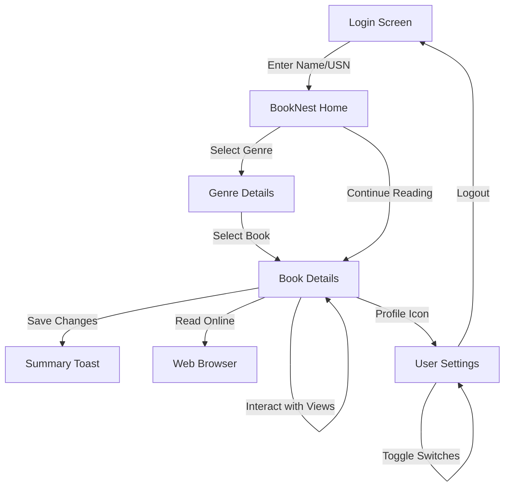

# Experiment 6 — Basic Android Views

### BookNest — Android Book Discovery Application

This project is a continuation of the BookNest application, developed as part of the MCA Android Development laboratory. While Experiment 5 focused on Android Notifications, **Experiment 6** demonstrates the integration and handling of **Basic Android Views** within a realistic application scenario.

---

## 1. Experiment Details

*   **Experiment Number:** 6
*   **Experiment Name:** Develop an Android application using basic Views
*   **Application:** BookNest
*   **Language:** Kotlin
*   **Platform:** Android
*   **IDE:** Android Studio
*   **Developer:** Sandy
*   **USN:** 25MCAR0133
*   **Course:** MCA

---

## 2. Aim
To develop an Android application using basic Android Views such as **TextView, EditText, ImageView, Button, CheckBox, RadioButton, Switch, Spinner, RatingBar, and ProgressBar**, and demonstrate their usage through an interactive BookNest application.

---

## 3. Objective
*   Understand the purpose and properties of standard Android UI components.
*   Design a premium, interactive user interface using XML layouts.
*   Handle user interactions and inputs using Kotlin.
*   Implement event listeners to respond to user actions in real-time.
*   Manage data passing between Activities using Intent Extras.
*   Demonstrate Activity back-stack management for secure logout functionality.

---

## 4. Scenario
BookNest is a digital sanctuary for book discovery. In this experiment, the basic views are integrated into the core user journey:
1.  **Login**: Users enter their credentials using **EditText**.
2.  **Discovery**: Browse through categories and select books.
3.  **Book Details**: The primary hub for Experiment 6. Users view metadata via **TextViews** and **ImageViews**, rate books using a **RatingBar**, update their reading status with **RadioButtons**, and toggle reminders with a **Switch**.
4.  **Interaction**: Users can save their personal notes in an **EditText** and perform actions like "Read Book" or "Save Changes" via **Buttons**.

---

## 5. Basic Views Implementation

| View | Purpose | Implementation Location |
| :--- | :--- | :--- |
| **TextView** | Displays titles, authors, descriptions, and user profile info. | Throughout all screens |
| **ImageView** | Displays book covers and decorative vector icons. | `BookDetailsActivity`, `HomeFragment` |
| **EditText** | Accepts user input for Name, USN, and Personal Notes. | `LoginActivity`, `BookDetailsActivity` |
| **Button** | Triggers login, saving changes, and opening resources. | `LoginActivity`, `BookDetailsActivity` |
| **CheckBox** | Allows users to toggle "Add to Favorites" status. | `BookDetailsActivity` |
| **RadioButton** | Provides mutually exclusive "Reading Status" choices. | `BookDetailsActivity` (within RadioGroup) |
| **Switch** | Toggles Notifications, Dark Mode, and Reminders. | `UserSettingsActivity`, `BookDetailsActivity` |
| **Spinner** | Provides a dropdown menu for selecting book genres. | `BookDetailsActivity` |
| **RatingBar** | Allows users to provide a 1-5 star rating for a book. | `BookDetailsActivity` |
| **ProgressBar**| Visualizes current reading progress (animated). | `BookDetailsActivity` |

---

## 6. Technology & Event Handling

The application utilizes **Kotlin** for back-end logic, ensuring smooth interaction with the UI components.

### Event Listeners Used:
*   **`setOnClickListener`**: Used for all buttons to trigger navigation or action summaries.
*   **`setOnCheckedChangeListener`**: Used for the **CheckBox** (Favorites), **Switch** (Settings), and **RadioGroup** (Status) to handle state changes.
*   **`setOnRatingBarChangeListener`**: Updates a descriptive label in real-time as the user selects stars.
*   **`setOnItemSelectedListener`**: Used by the **Spinner** to respond when a new genre is selected from the dropdown.

---

## 7. Data Passing (Intent Extras)
The application maintains user context by passing data between Activities:
*   **`USER_NAME`**: Captured at login and displayed on the Home and Settings screens.
*   **`USER_USN`**: Passed throughout the app to personalize the experience.
*   **`BOOK_DATA`**: A Parcelable `Book` object passed from the Home/Genre screens to the `BookDetailsActivity`.

---

## 8. Experiment 5 Continuation
Experiment 5 notification functionality has been fully retained. Successful login triggers a **Login Notification**, and interacting with the "Add to Library" button triggers a **Reading Reminder Notification**, demonstrating the integration of system services with basic UI views.

---

## 9. User Flow


---

## 10. Project Structure
```text
BookNest/
├── app/
│   ├── src/
│   │   └── main/
│   │       ├── java/com/example/exp5notification/
│   │       │   ├── data/
│   │       │   │   ├── Book.kt (Parcelable Model)
│   │       │   │   └── BookRepository.kt (Dynamic Data)
│   │       │   └── ui/
│   │       │       ├── LoginActivity.kt
│   │       │       ├── MainActivity.kt
│   │       │       ├── HomeFragment.kt
│   │       │       ├── BookDetailsActivity.kt (Basic Views Focus)
│   │       │       ├── UserSettingsActivity.kt (Basic Views Focus)
│   │       │       ├── GenreDetailsActivity.kt
│   │       │       └── MagicBackgroundView.kt (Custom Animation)
│   │       ├── res/
│   │       │   ├── drawable/ (Gradients, Glass Styles, Vector Icons)
│   │       │   ├── layout/ (XML definitions for all screens)
│   │       │   └── values/ (Themes, Colors, Strings)
│   │       └── AndroidManifest.xml
│   └── build.gradle.kts
├── README.md
└── settings.gradle.kts
```

---
**Developed for MCA Android Development Lab**
